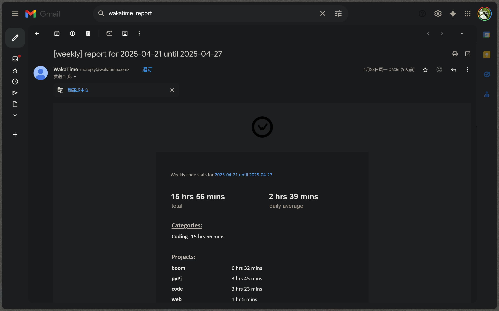
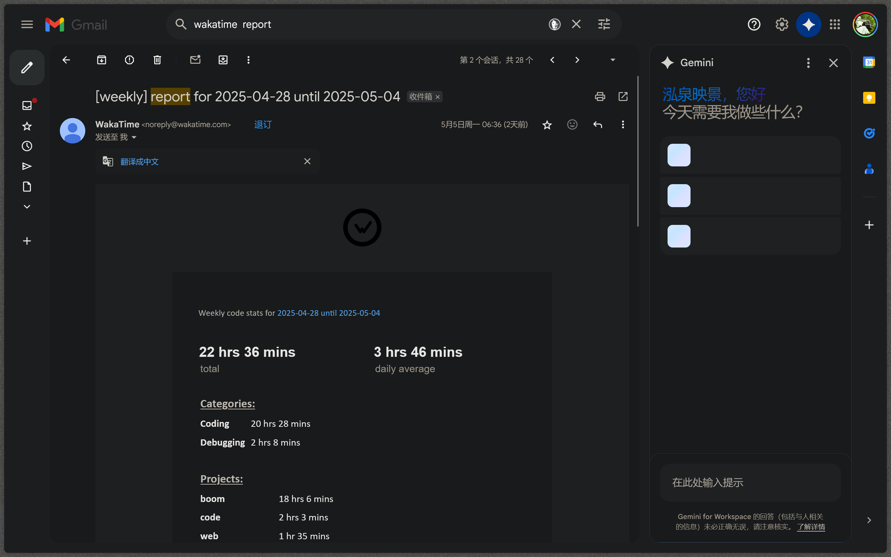
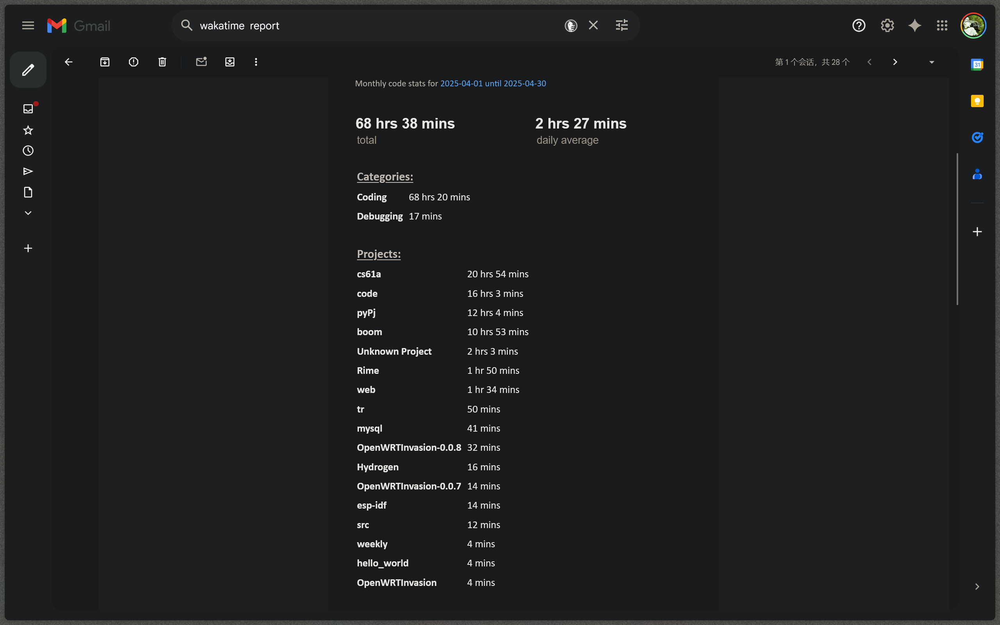

# 终端扫雷游戏

## 项目简介

这是一个基于Python实现的终端版扫雷游戏。游戏使用ANSI转义序列在终端中绘制界面，支持键盘操作，包括方向键移动、标记和揭示方块等功能。游戏提供了类似vim的相对坐标显示功能，使玩家能够更方便地定位格子位置。

## 功能特点

- 完全基于终端界面，无需图形界面支持
- 支持Windows和类Unix系统
- 使用ANSI转义序列进行界面绘制和光标操作
- 支持无缓冲键盘输入，实时响应按键操作
- 多种按键映射支持(WASD/HJKL和方向键(使用了按键映射, <>^v代替表示方向键))
- 支持相对坐标系统，方便定位
- 彩色界面显示，使用不同背景色区分元素
- 支持数字键快速移动多格
- 递归揭示空白区域

## 操作说明

### 移动光标
- 向上: `k`, `w` 或 `^`
- 向下: `j`, `s` 或 `v`
- 向左: `h`, `a` 或 `<`
- 向右: `l`, `d` 或 `>`
- 数字键: 输入数字后按方向键可一次移动多格
- 可以使用退格键将缓冲区的数字//10
- 其他按键会在命令行打印错误，下次按按键会清除上一次的错误信息

### 游戏操作
- 标记方块: `f` - 在可能有地雷的位置插旗
- 揭示方块: `e` - 揭示当前选中的方块
- 退出游戏: `q` - 退出当前游戏
- 删除输入: `Backspace` - 删除已输入的数字

## 游戏规则

1. 游戏开始时，所有方块都是隐藏状态
2. 使用方向键移动光标，选择要揭示的方块
3. 揭示方块后：
   - 如果是地雷，游戏结束
   - 如果是数字，表示周围8个方块中地雷的数量
   - 如果是空白，会自动揭示周围的空白方块和数字
4. 通过标记可能有地雷的方块来帮助自己推理
5. 成功揭示所有非地雷方块即获胜

## 技术实现

- 使用`colorama`库处理跨平台的终端颜色
- 自定义`getch`函数实现无缓冲输入
- DFS算法实现连续空白区域的自动揭示
- 使用ANSI转义序列实现终端界面绘制和光标控制

## 运行要求

- Python 3.x
- colorama库
- 对于非Windows系统，需要支持termios的终端环境

## 如何运行

```bash
python main.py Line boom_count
# Line 与 boom_count都是可选

```
## wakatime日志(boom)为项目


## debug是因为当时colorama库的原因只能用pydebug运行，python解释器会出问题

## 五一假期期间发现的月报功能，不知为何统计时间会少很多，boom才十小时

